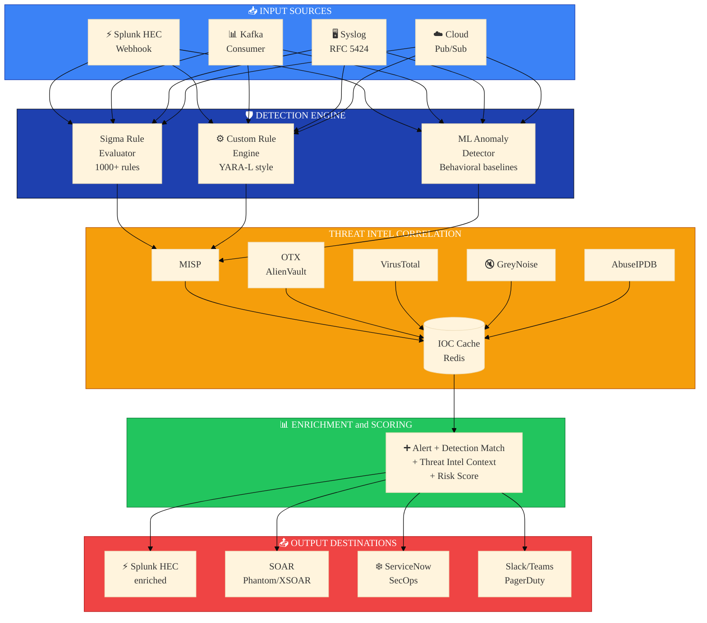

# ThreatForge


**Detection Engineering Pipeline with Threat Intelligence Correlation**

ThreatForge is an enterprise-grade detection pipeline that enriches security alerts with threat intelligence, applies ML-based anomaly detection, and integrates seamlessly with existing Splunk deployments. It enables Detection-as-Code workflows using Sigma rules while providing real-time IOC correlation from multiple threat intel feeds.

---

## Implementation Status

> **Current State:** Active development (~45% complete). Core ingestion and threat intel providers functional.

| Component | Status | Notes |
|-----------|--------|-------|
| **Ingestion** | | |
| Splunk HEC integration | Done | Ingest + output working |
| Kafka consumer | Not Started | Interface defined |
| Syslog receiver | Not Started | |
| Cloud Pub/Sub | Not Started | |
| **Threat Intel** | | |
| Provider abstraction | Done | Interface pattern |
| MISP client | Done | Full API integration |
| AlienVault OTX | Done | Basic implementation |
| VirusTotal | Partial | API defined, not tested |
| GreyNoise | Not Started | |
| AbuseIPDB | Not Started | |
| **Detection Engine** | | |
| Sigma rule loader | Partial | go-sigma integration started |
| Custom rule engine | Not Started | YARA-L style planned |
| ML anomaly detector | Not Started | Design only |
| **Enrichment** | | |
| Redis IOC cache | Not Started | Schema defined |
| MITRE ATT&CK mapping | Done | Technique mapping complete |
| Risk scoring | Partial | Basic implementation |
| **Output** | | |
| Splunk HEC output | Done | Enriched events |
| SOAR webhook | Not Started | |
| ServiceNow SecOps | Not Started | |
| Notifications | Not Started | |
| **Testing** | | |
| Unit tests | 10% | Minimal coverage |
| Integration tests | 0% | |

---

## Known Limitations

This is a **portfolio reference implementation**, not production software:

1. **11 TODO Placeholders** - Several functions in main.go have placeholder implementations
2. **Limited Threat Intel** - Only MISP/OTX fully integrated, others stubbed
3. **No Redis Cache** - IOC caching not implemented (hits providers directly)
4. **Sigma Engine Partial** - Rule loading works, full evaluation incomplete
5. **No ML Pipeline** - Anomaly detection designed but not built
6. **No Streaming Mode** - Kafka/Kinesis integrations not implemented
7. **Minimal Tests** - ~10% unit test coverage
8. **Telemetry Hub** - Merged module has interface-only implementations
9. **Auto-Remediation** - Action library designed, not executed

**Production Requirements:**
- Complete TODO implementations in main.go
- Implement Redis IOC cache layer
- Finish Sigma rule evaluation engine
- Add remaining threat intel providers
- Build ML anomaly detection pipeline
- Comprehensive test coverage

---

## What This Solves

Enterprise SOCs face critical challenges:
- **Alert Fatigue:** 10K+ daily alerts, 95% false positives
- **Context Gap:** Raw alerts lack threat intel enrichment
- **Detection Drift:** Correlation rules managed ad-hoc, no version control
- **Intel Silos:** Multiple threat feeds, no unified correlation

ThreatForge addresses these with:
- Splunk coexistence (enrich, don't replace)
- Multi-source threat intel correlation (MISP, OTX, VirusTotal, GreyNoise)
- Detection-as-Code with Sigma rules (Git-managed, CI/CD tested)
- ML behavioral baselines for anomaly detection
- SOAR integration for automated response

## Architecture



<details>
<summary>ASCII Diagram (Legacy)</summary>

```
┌─────────────────────────────────────────────────────────────────────────────────┐
│                           THREATFORGE ARCHITECTURE                               │
├─────────────────────────────────────────────────────────────────────────────────┤
│                                                                                  │
│  ┌──────────────────────────────────────────────────────────────────────────┐   │
│  │                         INPUT SOURCES                                     │   │
│  │  ┌─────────────┐  ┌─────────────┐  ┌─────────────┐  ┌─────────────┐      │   │
│  │  │ Splunk HEC  │  │ Kafka       │  │ Syslog      │  │ Cloud       │      │   │
│  │  │ Webhook     │  │ Consumer    │  │ (RFC 5424)  │  │ Pub/Sub     │      │   │
│  │  └──────┬──────┘  └──────┬──────┘  └──────┬──────┘  └──────┬──────┘      │   │
│  └─────────┼────────────────┼────────────────┼────────────────┼──────────────┘   │
│            │                │                │                │                   │
│            └────────────────┴────────┬───────┴────────────────┘                   │
│                                      │                                            │
│                                      ▼                                            │
│  ┌──────────────────────────────────────────────────────────────────────────┐   │
│  │                      DETECTION ENGINE                                     │   │
│  │  ┌─────────────────┐  ┌─────────────────┐  ┌─────────────────┐           │   │
│  │  │  Sigma Rule     │  │   Custom Rule   │  │   ML Anomaly    │           │   │
│  │  │  Evaluator      │  │   Engine        │  │   Detector      │           │   │
│  │  │                 │  │                 │  │                 │           │   │
│  │  │ • 1000+ rules   │  │ • Organization- │  │ • Behavioral    │           │   │
│  │  │ • Auto-update   │  │   specific      │  │   baselines     │           │   │
│  │  │ • MITRE mapping │  │ • YARA-L style  │  │ • Entity risk   │           │   │
│  │  └────────┬────────┘  └────────┬────────┘  └────────┬────────┘           │   │
│  └───────────┼────────────────────┼────────────────────┼────────────────────┘   │
│              │                    │                    │                         │
│              └────────────────────┼────────────────────┘                         │
│                                   ▼                                              │
│  ┌──────────────────────────────────────────────────────────────────────────┐   │
│  │                    THREAT INTEL CORRELATION                               │   │
│  │  ┌───────────┐ ┌───────────┐ ┌───────────┐ ┌───────────┐ ┌───────────┐   │   │
│  │  │   MISP    │ │   OTX     │ │ VirusTotal│ │ GreyNoise │ │  AbuseIPDB│   │   │
│  │  │           │ │ AlienVault│ │           │ │           │ │           │   │   │
│  │  └─────┬─────┘ └─────┬─────┘ └─────┬─────┘ └─────┬─────┘ └─────┬─────┘   │   │
│  │        │             │             │             │             │          │   │
│  │        └─────────────┴──────┬──────┴─────────────┴─────────────┘          │   │
│  │                             │                                             │   │
│  │                    ┌────────▼────────┐                                    │   │
│  │                    │  IOC Cache      │                                    │   │
│  │                    │  (Redis)        │                                    │   │
│  │                    │  • IP/Domain    │                                    │   │
│  │                    │  • Hash (MD5/   │                                    │   │
│  │                    │    SHA256)      │                                    │   │
│  │                    │  • URL          │                                    │   │
│  │                    └────────┬────────┘                                    │   │
│  └─────────────────────────────┼────────────────────────────────────────────┘   │
│                                │                                                 │
│                                ▼                                                 │
│  ┌──────────────────────────────────────────────────────────────────────────┐   │
│  │                      ENRICHMENT & SCORING                                 │   │
│  │                                                                           │   │
│  │  Alert + Detection Match + Threat Intel Context + Risk Score             │   │
│  │                                                                           │   │
│  │  ┌─────────────────────────────────────────────────────────────────┐     │   │
│  │  │  {                                                               │     │   │
│  │  │    "alert_id": "abc123",                                         │     │   │
│  │  │    "detection": "sigma:net_connection_win_script_host",          │     │   │
│  │  │    "mitre_attack": ["T1059.005", "T1071.001"],                   │     │   │
│  │  │    "threat_intel": {                                             │     │   │
│  │  │      "ip_reputation": "malicious",                               │     │   │
│  │  │      "sources": ["MISP:APT29", "OTX:Cozy Bear"],                 │     │   │
│  │  │      "first_seen": "2024-01-15",                                 │     │   │
│  │  │      "confidence": 0.92                                          │     │   │
│  │  │    },                                                            │     │   │
│  │  │    "risk_score": 87,                                             │     │   │
│  │  │    "priority": "P1"                                              │     │   │
│  │  │  }                                                               │     │   │
│  │  └─────────────────────────────────────────────────────────────────┘     │   │
│  └──────────────────────────────────────────────────────────────────────────┘   │
│                                │                                                 │
│                                ▼                                                 │
│  ┌──────────────────────────────────────────────────────────────────────────┐   │
│  │                         OUTPUT DESTINATIONS                               │   │
│  │  ┌─────────────┐  ┌─────────────┐  ┌─────────────┐  ┌─────────────┐      │   │
│  │  │ Splunk HEC  │  │ SOAR        │  │ ServiceNow  │  │ Slack/Teams │      │   │
│  │  │ (enriched)  │  │ Phantom/    │  │ SecOps      │  │ PagerDuty   │      │   │
│  │  │             │  │ XSOAR       │  │             │  │             │      │   │
│  │  └─────────────┘  └─────────────┘  └─────────────┘  └─────────────┘      │   │
│  └──────────────────────────────────────────────────────────────────────────┘   │
│                                                                                  │
└─────────────────────────────────────────────────────────────────────────────────┘
```

</details>

## Repository Structure

```
threatforge/
├── cmd/
│   └── server/main.go           # API server entrypoint
├── internal/
│   ├── api/gateway/             # API rate limiting
│   ├── compliance/              # Compliance finding schema
│   ├── config/config.go         # Configuration management
│   ├── enrichment/              # Alert enrichment pipeline
│   ├── ingestion/               # Splunk HEC integration
│   ├── mitre/                   # MITRE ATT&CK framework mapping
│   ├── observability/           # Logging, metrics, tracing
│   ├── playbooks/               # IR playbook management
│   ├── threatintel/             # Threat intel providers
│   ├── telemetry/               # Telemetry Hub (merged)
│   │   ├── ingestion/           # EDR/SIEM collectors (CrowdStrike, SentinelOne, Defender)
│   │   ├── normalization/       # OCSF/ECS schema normalization
│   │   └── correlation/         # Event correlation engine
│   └── remediation/             # Auto-Remediation Agents (merged)
│       ├── agents/              # Cloud-specific remediation agents
│       ├── actions/             # Remediation action library
│       └── workflows/           # Remediation workflows
├── rules/
│   ├── sigma/                   # Sigma rules (git submodule)
│   └── custom/                  # Organization-specific rules
├── configs/
│   └── config.yaml              # Configuration template
├── docs/
│   ├── architecture/            # HLD, diagrams
│   ├── adr/                     # Architecture Decision Records
│   ├── runbooks/                # Technical runbooks
│   └── DR-BC.md                 # Disaster Recovery & Business Continuity
├── k8s/
│   └── deployment.yaml          # Kubernetes manifests
├── Dockerfile
├── docker-compose.yml
├── go.mod
└── README.md
```

## Key Features

### Detection-as-Code with Sigma

```yaml
# rules/custom/credential_access/mimikatz_execution.yml
title: Mimikatz Execution Detection
id: f8f50f5c-587f-4e5e-a2de-74c5e7df1e9a
status: stable
description: Detects Mimikatz execution via command line patterns
author: ThreatForge
date: 2024/01/15
references:
    - https://attack.mitre.org/techniques/T1003/001/
logsource:
    category: process_creation
    product: windows
detection:
    selection:
        CommandLine|contains:
            - 'sekurlsa::logonpasswords'
            - 'lsadump::sam'
            - 'privilege::debug'
    condition: selection
falsepositives:
    - Legitimate security assessments
level: critical
tags:
    - attack.credential_access
    - attack.t1003.001
```

### Multi-Source Threat Intel

| Source | Type | Update Frequency | Cost |
|--------|------|------------------|------|
| MISP | Self-hosted aggregator | Real-time | Free (OSS) |
| AlienVault OTX | Community intel | Hourly | Free |
| VirusTotal | File/URL/IP reputation | Real-time | Freemium |
| GreyNoise | Internet scanner ID | Hourly | Freemium |
| AbuseIPDB | IP reputation | Real-time | Freemium |
| Mandiant | APT attribution | Daily | Enterprise |

### Splunk Integration Modes

**Mode 1: Webhook Receiver**
- Splunk alert action sends to ThreatForge webhook
- ThreatForge enriches and returns to Splunk HEC
- Best for: Targeted high-value alerts

**Mode 2: Streaming Processor**
- Kafka/Kinesis between Splunk and ThreatForge
- Continuous enrichment pipeline
- Best for: High-volume processing

**Mode 3: Batch Export**
- Scheduled export from Splunk via REST API
- Daily/hourly threat hunting
- Best for: Retrospective analysis


### Telemetry Hub (Merged)

Multi-source security telemetry aggregation and normalization:

| Source Type | Integrations | Schema |
|-------------|--------------|--------|
| **EDR** | CrowdStrike Falcon, SentinelOne, Microsoft Defender | OCSF |
| **SIEM** | Splunk, Microsoft Sentinel, Elasticsearch | ECS |
| **Cloud** | AWS CloudTrail, Azure Activity Logs, GCP Audit Logs | OCSF |

- **AI-Powered Analysis**: Claude-based contextual risk scoring
- **Attack Chain Correlation**: Identifies related events across sources
- **Identity Enrichment**: Context from Entra ID/Okta
- **Asset Enrichment**: CMDB integration for business context


### Auto-Remediation Agents (Merged)

Automated response to security findings:

- **Cloud Remediation**: AWS (Lambda), Azure (Functions), GCP (Cloud Functions)
- **Action Library**: Pre-built actions for common remediations
  - Isolate compromised instance
  - Revoke IAM credentials
  - Block malicious IP
  - Quarantine suspicious file
- **Approval Workflows**: Human-in-the-loop for critical actions
- **Rollback Support**: Undo remediation if false positive


| Component | Technology | Purpose |
|-----------|------------|---------|
| API Server | Go 1.22+ | Core detection engine |
| Rule Engine | go-sigma | Sigma rule evaluation |
| Cache | Redis | IOC lookup cache |
| Queue | Kafka (optional) | High-volume streaming |
| Database | PostgreSQL | Detection history, metrics |
| ML | Go + Python sidecar | Anomaly detection |

## Quick Start

### Prerequisites

- Go 1.22+
- Docker & Docker Compose
- Redis
- Splunk instance (for integration testing)
- API keys for threat intel providers (optional)

### Local Development

```bash
# Clone repository
git clone https://github.com/lvonguyen/threatforge.git
cd threatforge

# Initialize Sigma rules submodule
git submodule update --init --recursive

# Copy environment template
cp configs/config.example.yaml configs/config.yaml

# Start dependencies
docker-compose up -d redis

# Run server
go run cmd/server/main.go --config configs/config.yaml

# Test webhook endpoint
curl -X POST http://localhost:8080/api/v1/ingest \
  -H "Content-Type: application/json" \
  -d '{"source_ip": "185.220.101.1", "event_type": "network_connection"}'
```

### Splunk Configuration

```spl
# Create alert action to send to ThreatForge
| search index=security sourcetype=WinEventLog:Security EventCode=4688
| eval threat_forge_payload=json_object(
    "source_ip", src_ip,
    "dest_ip", dest_ip,
    "user", user,
    "process", process_name,
    "command_line", CommandLine
  )
| sendalert threatforge param.endpoint="http://threatforge:8080/api/v1/ingest"
```

## Roadmap

### Phase 1: Core Pipeline (Current)
- [x] Splunk HEC integration (ingest + output)
- [x] MISP threat intel provider
- [x] AlienVault OTX provider
- [x] MITRE ATT&CK mapping
- [ ] Complete Sigma rule evaluator
- [ ] VirusTotal/GreyNoise/AbuseIPDB integration
- [ ] Redis IOC cache implementation
- [ ] Resolve TODO placeholders in main.go

### Phase 2: Detection Engineering
- [ ] Git-based rule sync
- [ ] Rule testing framework
- [ ] MITRE ATT&CK coverage dashboard
- [ ] Custom rule DSL (YARA-L style)
- [ ] Unit test coverage (target: 80%)

### Phase 3: ML & Analytics
- [ ] Behavioral baseline engine
- [ ] Anomaly detection models (Python sidecar)
- [ ] Entity risk scoring refinement
- [ ] Threat hunting notebooks

### Phase 4: Enterprise Integration
- [ ] SOAR webhook outputs (Phantom/XSOAR)
- [ ] ServiceNow SecOps integration
- [ ] Kafka streaming mode
- [ ] Syslog/Pub-Sub ingestion
- [ ] Multi-tenant support


## Observability

- **Logging**: Structured JSON logging with zap
- **Metrics**: Prometheus metrics at `/metrics`
  - IOC ingestion/enrichment rates
  - Playbook execution metrics
  - MITRE technique coverage
- **Tracing**: OpenTelemetry distributed tracing
- **Health**: Kubernetes-ready probes at `/health`, `/ready`, `/live`

## Documentation

- [ADR-001: Threat Intel Architecture](docs/adr/ADR-001-threat-intel-architecture.md)
- [Technical Runbooks](docs/runbooks/README.md)
- [DR/BC Plan](docs/DR-BC.md)

## License

Apache 2.0 License - See [LICENSE](LICENSE)

---

**Author:** Liem Vo-Nguyen  
**LinkedIn:** [linkedin.com/in/liemvonguyen](https://linkedin.com/in/liemvonguyen)
